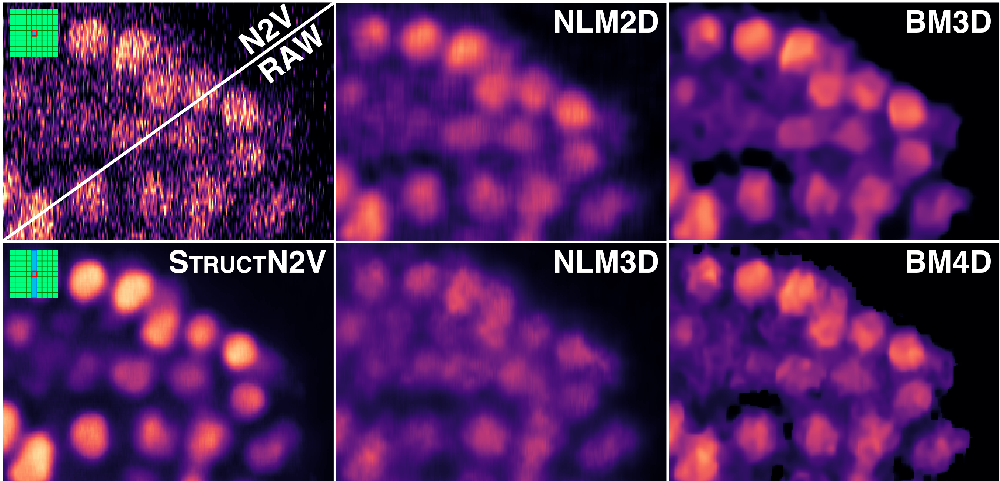

## StructN2V: Removing Structured Noise with Self-Supervised Blind-Spot Networks

StructN2V is a technique for removing structured noise from images using self-supervised convolutional neural networks.



See the [paper](https://colemanbroad.github.io/colemanb-net/Removing%20Structured%20Noise%20With%20Self-supervised%20Blind-spot%20Networks.pdf).

See the [technology feature](https://www.nature.com/articles/d41586-021-00023-0) in Nature.

Please cite as,

```
@inproceedings{broaddus2020structn2v,
  title={Removing Structured Noise with Self-Supervised Blind-Spot Networks},
  author={Broaddus, Coleman and Krull, Alexander and Weigert, Martin and Schmidt, Uwe and Myers, Eugene},
  booktitle={2020 IEEE 17th International Symposium on Biomedical Imaging (ISBI 2020)},
  year={2020},
  organization={IEEE},
}
```

